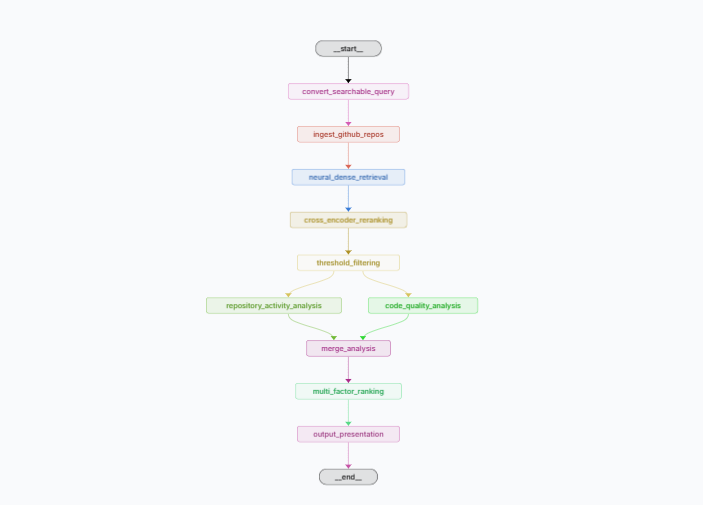
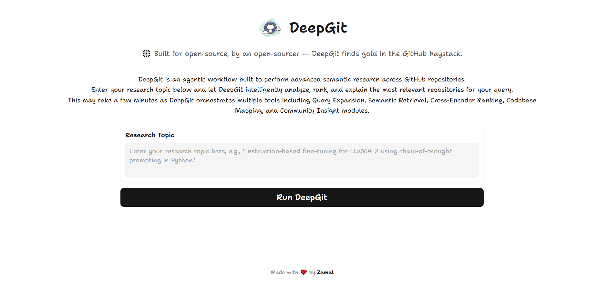
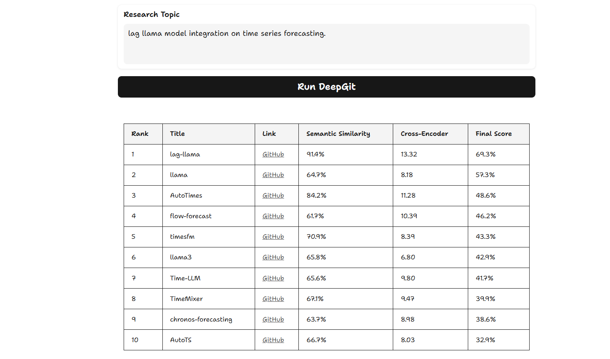

<h1 align="center">
   DeepGit
</h1>

<p align="center">
  
</p>

## DeepGit

**DeepGit** is an advanced, Langgraph-based agentic workflow designed to perform deep research across GitHub repositories. It intelligently searches, analyzes, and ranks repositories based on user intent—even uncovering less-known but highly relevant tools. DeepGit infuses hybrid dense retrieval with advanced cross-encoder re-ranking and comprehensive activity analysis into a unified, open-source platform for intelligent repository discovery

---

## ⚙️ How It Works — Agentic Workflow

When a user submits a query, the **DeepGit Orchestrator Agent** takes over, passing the query through a series of specialized tools:

1. **Query Expansion Tool**  
   Enhances vague user queries using language models to add specificity and context, enabling more accurate downstream retrieval.

2. **Semantic Retrieval Tool**  
   Leverages cutting-edge embedding models to semantically match the enhanced query against a wide array of GitHub repositories.

3. **Documentation Intelligence Tool**  
   Scrapes and interprets repository documentation (e.g., README files and additional markdowns) to understand the purpose, setup, and key features.

4. **Codebase Mapping Tool**  
   Analyzes the project’s file structure and technology stack to assess complexity, modularity, and suitability for the user’s needs.

5. **Community Insight Tool**  
   Aggregates social signals such as stars, forks, issues, and pull request activity to gauge real-world engagement and maturity.

6. **Relevance Synthesis Tool**  
   Combines insights from all modules to compute a final relevance score tailored to the user query.

7. **Insight Delivery Module**  
   Presents a ranked list of repositories with concise summaries and justifications, enabling smart discovery.

---

## 🚀 Goals

- **Uncover Hidden Gems:**  
  Surface powerful but under-the-radar open-source tools.

- **Empower Research:**  
  Build an intelligent discovery layer over GitHub tailored for research-focused developers.

- **Promote Open Innovation:**  
  Open-source the entire workflow to foster transparency and collaboration in research.

---

## 🖥️ User Interface

DeepGit provides an intuitive interface for exploring repository recommendations. The main page where users enter raw natural language query. This is the primary interaction point for initiating deep semantic searches.

<p align="center">
  
</p>

*Output:* Showcases the tabulated results with clickable links and different threshold scores, making it easy to compare and understand the ranking criteria.


<p align="center">
  
</p>

---


### 🔧 Recommended Environment

- **Python:** 3.11+ (The repo has been tested on Python 3.11.x)
- **pip:** 24.0+ (Ensure you have an up-to-date pip version)

---

### 👨‍🏭 Setup Instructions

#### 1. Clone the Repository
```bash
git clone https://github.com/zamalali/DeepGit.git
cd DeepGit
```

#### 2. Create a Virtual Environment (Recommended)
```bash
python3 -m venv venv
source venv/bin/activate   # On Windows: venv\Scripts\activate
```

#### 3. Upgrade pip (Optional but Recommended)
```bash
pip install --upgrade pip
```

#### 4. Install Dependencies
```bash
pip install -r requirements.txt
```

#### 5. 🚀 Running DeepGit via App

To run DeepGit locally, simply execute:

```bash
python app.py
```


### 🛠️ Troubleshooting

- **Python Version:** Use Python 3.11 or higher as the repo has been tested on Python 3.11.x.
- **pip Version:** Make sure you’re running pip 24.0 or later.
- **Dependency Issues:** If you encounter any, try reinstalling in a new virtual environment.


---

### 🛠️ Running DeepGit

For a detailed documentation on using DeepGit, Check out [here](docs).

DeepGit leverages Langgraph for orchestration. To launch the Langsmith dashboard and start the workflow, simply run:

```bash
langgraph dev
```
This command opens the Langsmith dashboard where you can enter your raw queries in a JSON snippet and monitor the entire agentic workflow.


### DeepGit on Docker
For instructions on using Docker with DeepGit, please refer to our [Docker Documentation](docs/docker.md).
