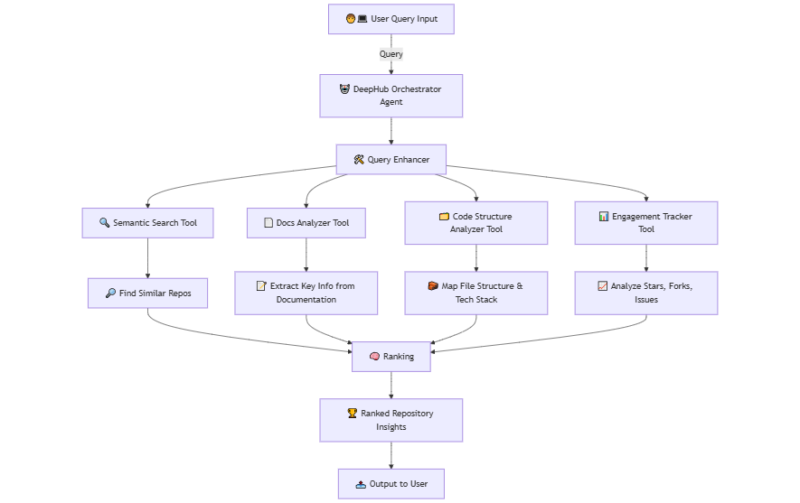

<h1 align="center">
   DeepGit
</h1>


<p align="center">
  
</p>

### DeepGit 2.0 🤯 — now **hardware‑aware** & **ColBERT‑powered**

## DeepGit

**DeepGit** is an advanced, Langgraph-based agentic workflow designed to perform deep research across GitHub repositories. It intelligently searches, analyzes, and ranks repositories based on user intent—even uncovering less-known but highly relevant tools. DeepGit infuses hybrid dense retrieval with advanced cross-encoder re-ranking and comprehensive activity analysis into a unified, open-source platform for intelligent repository discovery

---
### Try out the Lite version here 🧑‍🎓

DeepGit-lite is a lightweight version of DeepGit running on zero GPU on Hugging Face Space [here.](https://huggingface.co/spaces/zamal/DeepGit) <br>
It may not perform as well as the full version, but it's great for a quick first-hand preview.

---


The latest release makes it even **deeper, smarter, and faster**:

| New feature | What it gives you |
|-------------|------------------|
| **⚛️ Multi‑dimensional ColBERT v2 embeddings** | Fine‑grained token‑level similarity for nuanced matches that single‑vector embeddings miss. |
| **🔩 Smart Hardware Filter** | Tell DeepGit your device specs — CPU-only, low RAM, or mobile. It filters out repos that won’t run smoothly, so you only see ones that fit your setup. |

DeepGit still unifies hybrid dense retrieval, cross‑encoder re‑ranking, activity & quality analysis—but now every step is both *smarter* and *leaner*.

---

## ⚙️ How It Works — Agentic Workflow *v2*

When the user submits a query, the **DeepGit Orchestrator Agent** triggers a relay of expert tools:

1. **Query Expansion**  
   An LLM turns your natural‑language question into high‑signal GitHub tags for precise searching.

2. **Hardware Spec Detector**  
   The same pass infers your wording for hints like “GPU‑poor”, “low‑memory”, or “mobile‑only” and records the constraint.

3. **ColBERT‑v2 Semantic Retriever**  
   Every README & doc block is embedded with multi‑dimensional token vectors; MaxSim scoring surfaces nuanced matches.

4. **Cross‑Encoder Re‑ranker**  
   A lightweight BERT (`MiniLM‑L‑6‑v2`) re‑orders the top K results for passage‑level accuracy.

5. **Hardware‑aware Dependency Filter**  
   The reasoning engine inspects each repo’s `requirements.txt` / `pyproject.toml` and discards any that can’t run on your declared hardware.

6. **Community & Code Insight**  
   Collects stars, forks, issue cadence, commit history, plus quick code‑quality metrics.

7. **Multi‑factor Ranking & Delivery**  
   Merges all scores into one ranking and serves a clean table with links, similarity %, and “Runs on cpu‑only” badges where relevant.

---


## 🚀 Goals

- **Uncover Hidden Gems:**  
  Surface powerful but under-the-radar open-source tools. Now comes with hardware spec filter too.

- **Empower Research:**  
  Build an intelligent discovery layer over GitHub tailored for research-focused developers.

- **Promote Open Innovation:**  
  Open-source the entire workflow to foster transparency and collaboration in research.

---

## 🖥️ User Interface

DeepGit provides an intuitive interface for exploring repository recommendations. The main page where users enter raw natural language query. This is the primary interaction point for initiating deep semantic searches.

<p align="center">
  
</p>

*Output:* Showcases the tabulated results with clickable links and different threshold scores, making it easy to compare and understand the ranking criteria.


<p align="center">
  
</p>

---


### 🔧 Recommended Environment

- **Python:** 3.11+ (The repo has been tested on Python 3.11.x)
- **pip:** 24.0+ (Ensure you have an up-to-date pip version)

---

### 👨‍🏭 Setup Instructions

#### 1. Clone the Repository
```bash
git clone https://github.com/zamalali/DeepGit.git
cd DeepGit
```

#### 2. Create a Virtual Environment (Recommended)
```bash
python3 -m venv venv
source venv/bin/activate   # On Windows: venv\Scripts\activate
```

#### 3. Upgrade pip (Optional but Recommended)
```bash
pip install --upgrade pip
```

#### 4. Install Dependencies
```bash
pip install -r requirements.txt
```

#### 5. 🚀 Running DeepGit via App

To run DeepGit locally, simply execute:

```bash
python app.py
```


### 🛠️ Troubleshooting

- **Python Version:** Use Python 3.11 or higher as the repo has been tested on Python 3.11.x.
- **pip Version:** Make sure you’re running pip 24.0 or later.
- **Dependency Issues:** If you encounter any, try reinstalling in a new virtual environment.


---

### 🛠️ Running DeepGit

For a detailed documentation on using DeepGit, Check out [here](docs).

DeepGit leverages Langgraph for orchestration. To launch the Langsmith dashboard and start the workflow, simply run:

```bash
langgraph dev
```
This command opens the Langsmith dashboard where you can enter your raw queries in a JSON snippet and monitor the entire agentic workflow.


### DeepGit on Docker
For instructions on using Docker with DeepGit, please refer to our [Docker Documentation](docs/docker.md).
